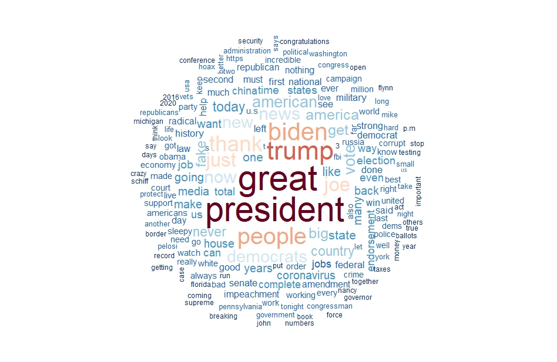

# Une analyse NLP des Tweets de Donald TRUMP

{width=50%}

Des variations NLP sur le corpus [Trump Twitter Archive](https://www.thetrumparchive.com/), quelques analyses sont [disponibles ici](https://benaventc.github.io/TrumpTwitterArchive_variation/trump.html). On pourra lire ce [document](https://www.researchgate.net/publication/337744581_NLP_text_mining_V40_-_une_introduction_-_cours_programme_doctoral) pour un panorama plus générals des méthodes de base du NLP.

 * [Introduction](https://benaventc.github.io/TrumpTwitterArchive_variation/trump1introduction.html) : 
 * [Analyse quantitative de la production des tweets](https://benaventc.github.io/TrumpTwitterArchive_variation/trump2descriptionquanti.html)
 * [Sentiments et émotions](https://benaventc.github.io/TrumpTwitterArchive_variation/trump3Extractiondusentiment.html)
 * [fondement moraux du discours de trump](https://benaventc.github.io/TrumpTwitterArchive_variation/trump4fondementmoraux.html)
 * [le sujet Biden]()Vectorisation du corpus
 * Cartes sémantique
 * LDA +
 * Le succès des Tweets : l'approche par les sentiments
 * Le succès des Tweets : l'approche par les contenus

